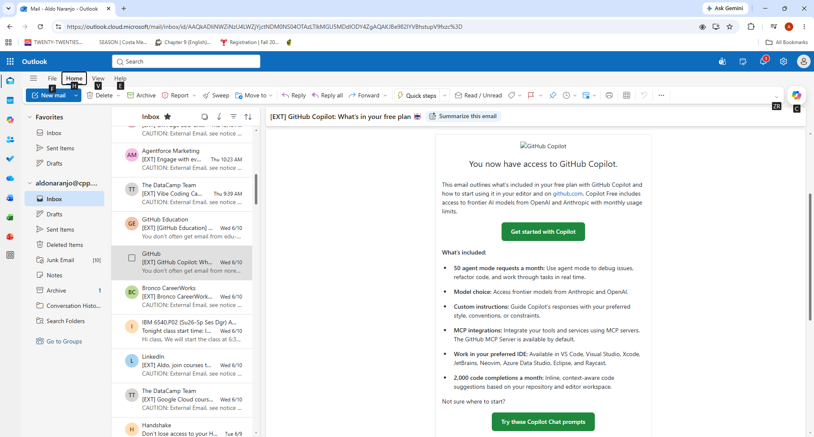

## Introduction

This essay reflects on what I learned from the Positron introductory materials in Week 6. Positron is a relatively new IDE from Posit, PBC, and going through the videos gave me a clearer picture of what it offers compared to what I have been using. My experience so far has mostly been in RStudio, so that is the lens I am coming from.

------------------------------------------------------------------------

## Prompt 1: Positron vs. RStudio — What I Like About Positron {#sec-positron-vs-rstudio}

> *Based on what you learned from Step 1 and Step 3, what do you like about Positron compared with RStudio?*

I have been using RStudio for a while now and my honest take is that it is fine once you get past the learning curve. Early on, I found it frustrating because a lot of the commands and behaviors were not explained well anywhere obvious. I had to piece things together through trial and error. At this point I have gotten comfortable enough that RStudio does not get in my way, but I do find it tedious at times, and I am still figuring out where its limits actually are.

::: {.callout-note title="What is Positron?"}
Positron is a free, open-source IDE built by Posit, PBC. It supports both R and Python and is built on VS Code's architecture, combining the strengths of RStudio and VS Code into a single environment.
:::

After watching the videos, a few things about Positron stood out to me as genuine improvements.

### Interface and Layout

The interface looks cleaner and more modern than RStudio. It has an activity bar and flexible sidebars that feel less rigid than RStudio's fixed four-pane layout. Since it is built on VS Code, it also looks familiar to anyone who has used a modern code editor before.

### Support for Both R and Python

This was probably the most interesting part to me. I am primarily an R user, so I have not felt a strong need for Python support inside RStudio. But seeing that Positron treats both languages equally made me think about how that could be useful down the line as I take on more varied projects.[^1]

[^1]: For students in programs that use both R and Python, this is a meaningful advantage over RStudio where Python support has always felt like an add-on.

### Data Explorer

The data explorer in Positron looks noticeably better than what RStudio offers. Being able to sort, filter, and scroll through a data frame interactively inside the IDE without writing extra code seems like a small thing but it adds up over time, especially when you are doing exploratory work.

### Project and Workspace Management

The workspace-based project setup is similar to how VS Code handles things. Opening a folder automatically initializes the environment, which seems like it would reduce the back and forth of setting working directories that I still find a little tedious in RStudio.

::: {.callout-tip title="Overall Impression"}
Positron does not feel like a completely different tool. It feels like RStudio with some rough edges smoothed out and with more room to grow. For someone like me who is already comfortable in RStudio, the transition does not look intimidating.
:::

------------------------------------------------------------------------

## Prompt 2: AI in Positron {#sec-ai-positron}

> *Describe the various ways you can use AI inside Positron. Which AI tools have you installed or set up? Which did you find beneficial?*

### AI Features in Positron

::: panel-tabset
#### Positron Assistant

Positron Assistant is the built-in AI chat tool. What makes it different from just opening a separate chat window is that it is context-aware. It can see what is loaded in your environment, what data frames you have open, and what files you are working in. That means instead of copying and pasting your code into a chat window like I typically do with ChatGPT or Claude, the assistant already knows what you are working with and can give more relevant responses.

#### Inline Code Suggestions

Positron supports inline code suggestions that appear as you type, similar to autocomplete but smarter. These show up as ghost text that you can accept or ignore. For repetitive tasks or when you cannot remember the exact syntax for something, this seems like it would save a decent amount of time.

#### Databot

Databot is a specialized tool built for exploratory data analysis. It follows something called the WEAR loop, which stands for Write, Execute, Analyze, Repeat. The idea is that it helps you move through EDA faster by generating visualizations and summaries based on natural language prompts rather than writing everything manually from scratch.

#### Bring Your Own LLM

Positron also lets you connect your own AI provider, whether that is OpenAI, Anthropic, or something else. Some options are free and some are paid depending on the provider. This gives users flexibility to use whatever model they are already comfortable with.
:::

### Free vs. Paid AI Options

| Tool | Cost | Notes |
|------------------------|------------------------|------------------------|
| Positron Assistant | Free | Included with Positron |
| GitHub Copilot | Free (Education) | Requires GitHub Student Developer Pack |
| OpenAI or Claude via API | Paid | Bring Your Own LLM option |
| Databot | Free with Positron Pro | Available in the Pro tier |

### GitHub Copilot {#sec-copilot}

I had not used GitHub Copilot before this assignment. After learning it was free for students through the GitHub Education program, I applied using my Cal Poly Pomona email and was accepted into the GitHub Student Developer Pack.

{#fig-copilot fig-alt="Screenshot showing GitHub Education program acceptance"}

### Was Copilot Helpful or Distracting?

::: {.callout-important title="My Take on GitHub Copilot"}
Going into this I was a bit skeptical, mostly because I already second guess AI suggestions when I use ChatGPT or Claude for coding help. I do not blindly trust what comes back and I usually verify things myself before moving on. That said, I can see how inline suggestions inside the editor would be more convenient than switching between windows. The fact that it suggests code as you type rather than requiring you to ask a question feels like a more natural part of the workflow. I think whether it is helpful or distracting probably comes down to how disciplined you are about reviewing what it gives you. For me, the habit of double checking is already there, so I think I would get more benefit than distraction out of it.
:::

------------------------------------------------------------------------

## Prompt 3: Publishing to GitHub Pages {#sec-github-pages}

> *Publish this report to GitHub Pages and provide a URL.*

To publish this report I rendered the `.qmd` file to HTML using Quarto, pushed the project to a GitHub repository, and enabled GitHub Pages in the repository settings pointing to the folder containing the rendered HTML file.

::: {.callout-note title="Published Report"}
**GitHub Pages URL:** https://naran115.github.io/Intro-Positron-Aldo
:::

------------------------------------------------------------------------

## Summary

Going through these materials gave me a clearer sense of where Positron fits relative to RStudio. It is not a dramatic departure but more of a natural upgrade, especially for someone who is already comfortable with R and wants a more flexible environment. The AI tools are the most interesting part to me, not because I plan to rely on them heavily, but because having them integrated directly into the IDE rather than as a separate window is a meaningful quality of life improvement.
